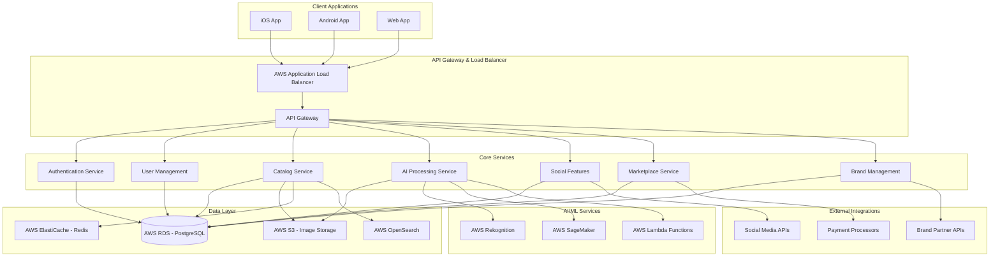

# Design Document

## Overview

Vangarments is a comprehensive fashion platform that combines wardrobe cataloging, social networking, marketplace functionality, and professional tools into a unified ecosystem. The platform leverages the proprietary Vangarments Universal Fashion Standard (VUFS) and AI-powered automation to create the world's most advanced fashion intelligence platform.

The design prioritizes scalability, starting with a simple MVP while building on AWS infrastructure that can grow to support millions of users and become the backbone of global fashion data management.

## Architecture

### High-Level Architecture



### Technology Stack

**Frontend:**
- **iOS:** Swift/SwiftUI for native iOS experience
- **Android:** Kotlin/Jetpack Compose for native Android experience  
- **Web:** React/Next.js for responsive web application
- **Shared:** TypeScript for type safety across platforms

**Backend:**
- **API:** Node.js/Express or Python/FastAPI for REST APIs
- **Database:** PostgreSQL on AWS RDS for relational data
- **Cache:** Redis on AWS ElastiCache for performance
- **Search:** AWS OpenSearch for advanced search capabilities
- **Storage:** AWS S3 for image and file storage

**AI/ML:**
- **Image Processing:** AWS Rekognition for basic image analysis
- **Custom Models:** AWS SageMaker for VUFS-specific AI training
- **Serverless Processing:** AWS Lambda for image processing workflows
- **Model Training:** Custom fashion recognition models trained on proprietary dataset

**Infrastructure:**
- **Cloud Provider:** AWS for scalability and reliability
- **Container Orchestration:** AWS ECS or EKS for service management
- **CDN:** AWS CloudFront for global content delivery
- **Monitoring:** AWS CloudWatch and third-party APM tools

## Components and Interfaces

### Core Components

#### 1. Authentication & User Management
**Purpose:** Handle user registration, authentication, and profile management with Brazilian market integration

**Key Features:**
- CPF-based registration for Brazilian users
- Multi-platform authentication (iOS, Android, Web)
- Role-based access control (Consumer, Influencer, Brand Owner, etc.)
- Profile customization with measurements and preferences

**Interfaces:**
```typescript
interface UserProfile {
  id: string;
  cpf: string; // Brazilian personal ID
  personalInfo: {
    name: string;
    birthDate: Date;
    location: Location;
    gender: Gender;
  };
  measurements: UserMeasurements;
  preferences: FashionPreferences;
  badges: Badge[];
  socialLinks: SocialLink[];
}

interface UserMeasurements {
  height: number;
  weight: number;
  sizes: {
    [standard: string]: SizeChart; // BR, US, EU, UK
  };
}
```

#### 2. VUFS Catalog Engine
**Purpose:** Core cataloging system implementing Vangarments Universal Fashion Standard

**Key Features:**
- Hierarchical categorization system
- Comprehensive metadata management
- Brand/line/collaboration tracking
- Automated item identification and tagging

**Interfaces:**
```typescript
interface VUFSItem {
  id: string;
  vufsCode: string; // Unique global identifier
  category: CategoryHierarchy;
  brand: BrandHierarchy;
  metadata: ItemMetadata;
  images: ItemImage[];
  condition: ItemCondition;
  ownership: OwnershipInfo;
}

interface CategoryHierarchy {
  page: string; // Top level
  blueSubcategory: string; // Second level
  whiteSubcategory: string; // Third level
  graySubcategory: string; // Fourth level
}

interface ItemMetadata {
  composition: Material[];
  colors: Color[];
  careInstructions: string[];
  acquisitionInfo: AcquisitionInfo;
  pricing: PricingInfo;
}
```

#### 3. AI Processing Engine
**Purpose:** Automated image processing, item recognition, and cataloging assistance

**Key Features:**
- Background removal and image enhancement
- Fashion item detection and classification
- Automated VUFS property extraction
- Continuous learning from user interactions

**Interfaces:**
```typescript
interface AIProcessingResult {
  itemDetection: {
    confidence: number;
    boundingBox: BoundingBox;
    category: string;
  };
  vufsProperties: {
    [property: string]: {
      value: any;
      confidence: number;
    };
  };
  suggestedTags: Tag[];
  backgroundRemoved: boolean;
}

interface AITrainingData {
  imageUrl: string;
  groundTruthLabels: VUFSItem;
  userFeedback: UserFeedback;
}
```

#### 4. Social Platform Engine
**Purpose:** Social networking features including feeds, interactions, and content sharing

**Key Features:**
- Pinterest-like content discovery
- Outfit sharing and social proof
- User following and wardrobe viewing
- Content creation tools

**Interfaces:**
```typescript
interface SocialPost {
  id: string;
  userId: string;
  type: 'outfit' | 'item' | 'inspiration';
  content: PostContent;
  wardrobeItems: VUFSItem[];
  engagement: {
    likes: number;
    comments: Comment[];
    shares: number;
  };
  visibility: VisibilitySettings;
}

interface OutfitCombination {
  id: string;
  name: string;
  items: VUFSItem[];
  occasion: string;
  season: string;
  createdAt: Date;
}
```

#### 5. Marketplace Engine
**Purpose:** Peer-to-peer and brand marketplace with integrated payment processing

**Key Features:**
- Item listing and condition assessment
- Secure payment processing
- Shipping coordination
- Transaction history and ratings

**Interfaces:**
```typescript
interface MarketplaceListing {
  id: string;
  item: VUFSItem;
  seller: UserProfile;
  pricing: {
    askingPrice: number;
    marketValue: number;
    priceHistory: PricePoint[];
  };
  condition: DetailedCondition;
  shipping: ShippingOptions;
  status: ListingStatus;
}

interface Transaction {
  id: string;
  listing: MarketplaceListing;
  buyer: UserProfile;
  seller: UserProfile;
  payment: PaymentInfo;
  shipping: ShippingInfo;
  status: TransactionStatus;
}
```

#### 6. Brand Partnership Platform
**Purpose:** Brand integration, catalog management, and partnership features

**Key Features:**
- Dedicated brand pages and catalogs
- Store-brand catalog relationships
- Commission tracking and revenue sharing
- Partnership management tools

**Interfaces:**
```typescript
interface BrandAccount {
  id: string;
  brandInfo: BrandInfo;
  catalog: BrandCatalog;
  partnerships: Partnership[];
  analytics: BrandAnalytics;
  badges: BrandBadge[];
}

interface BrandCatalog {
  items: VUFSItem[];
  categories: CategoryTree;
  pricing: PricingStrategy;
  availability: InventoryInfo;
}

interface Partnership {
  brandId: string;
  storeId?: string;
  commissionRate: number;
  terms: PartnershipTerms;
  performance: PartnershipMetrics;
}
```

## Data Models

### Core Data Entities

#### User Data Model
```sql
-- Users table with Brazilian market integration
CREATE TABLE users (
    id UUID PRIMARY KEY,
    cpf VARCHAR(14) UNIQUE NOT NULL, -- Brazilian personal ID
    email VARCHAR(255) UNIQUE NOT NULL,
    password_hash VARCHAR(255) NOT NULL,
    profile JSONB NOT NULL, -- Flexible profile data
    measurements JSONB, -- Size information across standards
    preferences JSONB, -- Fashion preferences and settings
    created_at TIMESTAMP DEFAULT NOW(),
    updated_at TIMESTAMP DEFAULT NOW()
);

-- User roles and permissions
CREATE TABLE user_roles (
    user_id UUID REFERENCES users(id),
    role VARCHAR(50) NOT NULL, -- consumer, influencer, brand_owner, etc.
    granted_at TIMESTAMP DEFAULT NOW(),
    PRIMARY KEY (user_id, role)
);
```

#### VUFS Item Data Model
```sql
-- Core items table following VUFS standard
CREATE TABLE vufs_items (
    id UUID PRIMARY KEY,
    vufs_code VARCHAR(50) UNIQUE NOT NULL, -- Global unique identifier
    owner_id UUID REFERENCES users(id),
    category_hierarchy JSONB NOT NULL, -- Page > Blue > White > Gray
    brand_hierarchy JSONB NOT NULL, -- Brand > Line > Collaboration
    metadata JSONB NOT NULL, -- Composition, colors, care, etc.
    condition_info JSONB NOT NULL,
    acquisition_info JSONB,
    pricing_info JSONB,
    visibility_settings JSONB DEFAULT '{"public": true}',
    created_at TIMESTAMP DEFAULT NOW(),
    updated_at TIMESTAMP DEFAULT NOW()
);

-- Item images with processing status
CREATE TABLE item_images (
    id UUID PRIMARY KEY,
    item_id UUID REFERENCES vufs_items(id),
    image_url VARCHAR(500) NOT NULL,
    image_type VARCHAR(20) NOT NULL, -- front, back, detail
    processing_status VARCHAR(20) DEFAULT 'pending',
    ai_analysis JSONB, -- AI processing results
    created_at TIMESTAMP DEFAULT NOW()
);
```

#### Social Platform Data Model
```sql
-- Social posts and content
CREATE TABLE social_posts (
    id UUID PRIMARY KEY,
    user_id UUID REFERENCES users(id),
    post_type VARCHAR(20) NOT NULL, -- outfit, item, inspiration
    content JSONB NOT NULL,
    wardrobe_items UUID[], -- Array of item IDs
    engagement_stats JSONB DEFAULT '{"likes": 0, "comments": 0, "shares": 0}',
    visibility VARCHAR(20) DEFAULT 'public',
    created_at TIMESTAMP DEFAULT NOW()
);

-- User relationships and following
CREATE TABLE user_follows (
    follower_id UUID REFERENCES users(id),
    following_id UUID REFERENCES users(id),
    created_at TIMESTAMP DEFAULT NOW(),
    PRIMARY KEY (follower_id, following_id)
);
```

#### Marketplace Data Model
```sql
-- Marketplace listings
CREATE TABLE marketplace_listings (
    id UUID PRIMARY KEY,
    item_id UUID REFERENCES vufs_items(id),
    seller_id UUID REFERENCES users(id),
    asking_price DECIMAL(10,2) NOT NULL,
    condition_assessment JSONB NOT NULL,
    description TEXT,
    shipping_options JSONB,
    status VARCHAR(20) DEFAULT 'active',
    created_at TIMESTAMP DEFAULT NOW(),
    updated_at TIMESTAMP DEFAULT NOW()
);

-- Transactions and payments
CREATE TABLE transactions (
    id UUID PRIMARY KEY,
    listing_id UUID REFERENCES marketplace_listings(id),
    buyer_id UUID REFERENCES users(id),
    seller_id UUID REFERENCES users(id),
    amount DECIMAL(10,2) NOT NULL,
    payment_info JSONB,
    shipping_info JSONB,
    status VARCHAR(20) DEFAULT 'pending',
    created_at TIMESTAMP DEFAULT NOW(),
    completed_at TIMESTAMP
);
```

#### Brand Partnership Data Model
```sql
-- Brand accounts and information
CREATE TABLE brand_accounts (
    id UUID PRIMARY KEY,
    user_id UUID REFERENCES users(id), -- Associated user account
    brand_name VARCHAR(255) NOT NULL,
    brand_info JSONB NOT NULL,
    verification_status VARCHAR(20) DEFAULT 'pending',
    partnership_tier VARCHAR(20) DEFAULT 'basic',
    created_at TIMESTAMP DEFAULT NOW()
);

-- Brand catalogs and items
CREATE TABLE brand_catalog_items (
    id UUID PRIMARY KEY,
    brand_id UUID REFERENCES brand_accounts(id),
    vufs_item_id UUID REFERENCES vufs_items(id),
    official_price DECIMAL(10,2),
    availability_status VARCHAR(20) DEFAULT 'available',
    purchase_link VARCHAR(500),
    created_at TIMESTAMP DEFAULT NOW()
);
```

## Error Handling

### Error Classification System

**Client Errors (4xx):**
- `400 Bad Request`: Invalid input data or malformed requests
- `401 Unauthorized`: Authentication required or invalid credentials
- `403 Forbidden`: Insufficient permissions for requested action
- `404 Not Found`: Requested resource does not exist
- `409 Conflict`: Resource conflict (e.g., duplicate CPF registration)
- `422 Unprocessable Entity`: Valid request but business logic validation failed

**Server Errors (5xx):**
- `500 Internal Server Error`: Unexpected server-side errors
- `502 Bad Gateway`: External service integration failures
- `503 Service Unavailable`: Temporary service overload or maintenance
- `504 Gateway Timeout`: External service timeout

### Error Response Format
```typescript
interface ErrorResponse {
  error: {
    code: string;
    message: string;
    details?: any;
    timestamp: string;
    requestId: string;
  };
}
```

### Error Handling Strategies

**AI Processing Errors:**
- Graceful degradation when AI services are unavailable
- Fallback to manual categorization with user assistance
- Retry mechanisms for transient AI service failures
- User feedback collection for improving AI accuracy

**Payment Processing Errors:**
- Comprehensive payment failure handling
- Clear user communication about payment issues
- Automatic retry for transient payment failures
- Secure storage of payment attempt logs

**Image Processing Errors:**
- Multiple image format support with conversion fallbacks
- Progressive image loading and optimization
- Backup storage strategies for image failures
- User notification for image processing delays

## Testing Strategy

### Testing Pyramid Approach

**Unit Tests (70%):**
- Core business logic validation
- VUFS standard implementation
- AI processing algorithms
- Data model integrity
- Utility functions and helpers

**Integration Tests (20%):**
- API endpoint functionality
- Database operations and transactions
- External service integrations (AWS, payment processors)
- Cross-service communication
- Authentication and authorization flows

**End-to-End Tests (10%):**
- Critical user journeys (registration, cataloging, marketplace)
- Cross-platform compatibility
- Performance under load
- Security vulnerability testing
- User acceptance scenarios

### Testing Tools and Frameworks

**Backend Testing:**
- **Unit Tests:** Jest/Mocha for Node.js, pytest for Python
- **Integration Tests:** Supertest for API testing
- **Database Tests:** Test containers for isolated database testing
- **Load Testing:** Artillery or k6 for performance testing

**Frontend Testing:**
- **Unit Tests:** Jest + React Testing Library for web
- **UI Tests:** XCTest for iOS, Espresso for Android
- **E2E Tests:** Cypress or Playwright for web automation
- **Visual Regression:** Percy or Chromatic for UI consistency

**AI/ML Testing:**
- **Model Validation:** Custom frameworks for fashion recognition accuracy
- **Data Quality:** Automated checks for training data integrity
- **Performance Testing:** Model inference speed and resource usage
- **A/B Testing:** Framework for comparing model versions

### Continuous Integration Pipeline

```yaml
# Example CI/CD pipeline structure
stages:
  - lint_and_format
  - unit_tests
  - integration_tests
  - security_scan
  - build_and_package
  - deploy_staging
  - e2e_tests
  - deploy_production
```

**Quality Gates:**
- Minimum 80% code coverage for new code
- All security scans must pass
- Performance benchmarks must be maintained
- AI model accuracy thresholds must be met
- Cross-platform compatibility verified

This design provides a solid foundation for building Vangarments while maintaining flexibility for future feature expansion and global scaling. The architecture leverages AWS services for reliability and scalability while implementing the proprietary VUFS standard that positions the platform as the future backbone of fashion data management.