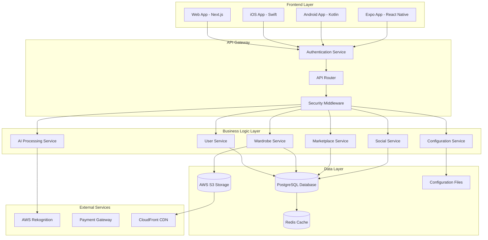

# Design Document

## Overview

This design document outlines the architecture and implementation strategy to transform the Vangarments fashion platform from a prototype with mock data into a fully functional production application. The current system has extensive backend infrastructure and frontend components, but suffers from disconnected data flows, non-functional navigation, and heavy reliance on mock data that prevents real user interactions.

The design focuses on establishing proper data persistence, functional API integration, working navigation, and eliminating all mock data dependencies while maintaining the existing feature set across web, iOS, and Android platforms.

## Architecture

### Current State Analysis

Based on code analysis, the current system has:

**Strengths:**
- Comprehensive backend API with proper authentication, security middleware, and database models
- Well-structured frontend with React/Next.js, proper component architecture, and API client
- Extensive feature coverage including VUFS system, marketplace, social features, and AI processing
- Cross-platform mobile applications (iOS/Android/Expo)

**Critical Issues:**
- Mock API interceptor preventing real API calls in development
- Disconnected frontend-backend data flow
- Non-functional navigation and routing
- Mock data system that prevents real user interactions and data building
- Missing database initialization for real data storage
- Incomplete API endpoint implementations for actual data persistence

### Target Architecture



## Components and Interfaces

### 1. Database Integration Layer

**Purpose:** Establish reliable database connections and ensure proper data persistence

**Components:**
- Database connection pool management
- Migration system for schema updates
- Seeding system for initial data
- Transaction management for data consistency

**Key Interfaces:**
```typescript
interface DatabaseService {
  initialize(): Promise<void>;
  runMigrations(): Promise<void>;
  seedInitialData(): Promise<void>;
  healthCheck(): Promise<boolean>;
}
```

### 2. Real Data Flow System

**Purpose:** Completely eliminate mock data and establish real data persistence that builds over time

**Components:**
- Remove all mock API interceptors and mock data generators
- Direct database integration for all data operations
- Real-time data persistence during app usage
- Progressive data building through actual user interactions

**Key Interfaces:**
```typescript
interface RealDataService {
  removeMockSystems(): void;
  initializeEmptyDatabase(): void;
  enableDirectDataPersistence(): void;
  buildDataThroughUsage(): void;
  validateRealDataFlow(): Promise<boolean>;
}
```

### 3. Authentication & Authorization System

**Purpose:** Implement working user authentication with admin privileges for user "lv"

**Components:**
- JWT token management
- Role-based access control
- Admin user initialization
- Session persistence

**Key Interfaces:**
```typescript
interface AuthService {
  initializeAdminUser(): Promise<void>;
  validateUserCredentials(email: string, password: string): Promise<User>;
  grantAdminPrivileges(userId: string): Promise<void>;
  checkPermissions(userId: string, action: string): Promise<boolean>;
}
```

### 4. Real Wardrobe Building System

**Purpose:** Enable actual wardrobe creation that builds organically through real usage

**Components:**
- Real item creation with actual image upload and storage
- Persistent VUFS categorization that saves to database
- Incremental wardrobe building through daily usage
- Real search and filtering of user's actual items

**Key Interfaces:**
```typescript
interface RealWardrobeService {
  createRealItem(itemData: WardrobeItemData, images: File[]): Promise<WardrobeItem>;
  persistItemPermanently(item: WardrobeItem): Promise<void>;
  buildWardrobeOverTime(userId: string): Promise<void>;
  getUserRealItems(userId: string, filters?: ItemFilters): Promise<WardrobeItem[]>;
  trackWardrobeGrowth(userId: string): Promise<WardrobeStats>;
}
```

### 5. Configuration Management System

**Purpose:** Allow in-app configuration changes that persist to code files

**Components:**
- Dynamic configuration editor interface
- File system integration for config persistence
- VUFS standard management
- Real-time configuration updates

**Key Interfaces:**
```typescript
interface ConfigurationService {
  getEditableConfigs(): Promise<ConfigSection[]>;
  updateVUFSStandards(updates: VUFSUpdate[]): Promise<void>;
  updateSystemSettings(settings: SystemSettings): Promise<void>;
  persistConfigToFiles(): Promise<void>;
  rollbackChanges(configId: string): Promise<void>;
}
```

### 6. Navigation System

**Purpose:** Implement functional routing and navigation across all platforms

**Components:**
- Route configuration and management
- Navigation state management
- Deep linking support
- Platform-specific navigation handlers

**Key Interfaces:**
```typescript
interface NavigationService {
  configureRoutes(): void;
  handleNavigation(route: string, params?: any): Promise<void>;
  validateRouteAccess(route: string, user: User): boolean;
  setupDeepLinking(): void;
}
```

## Data Models

### Core Data Structures

**User Model (Enhanced):**
```typescript
interface User {
  id: string;
  email: string;
  cpf?: string;
  personalInfo: PersonalInfo;
  measurements?: UserMeasurements;
  preferences?: FashionPreferences;
  roles: UserRole[];
  isAdmin: boolean;
  createdAt: Date;
  updatedAt: Date;
}

interface UserRole {
  role: 'admin' | 'user' | 'brand' | 'influencer';
  permissions: Permission[];
}
```

**Wardrobe Item Model (Production-Ready):**
```typescript
interface WardrobeItem {
  id: string;
  userId: string;
  vufsCode: string;
  name: string;
  category: VUFSCategory;
  brand?: string;
  images: ItemImage[];
  metadata: ItemMetadata;
  condition: ItemCondition;
  acquisitionInfo?: AcquisitionInfo;
  isActive: boolean;
  createdAt: Date;
  updatedAt: Date;
}

interface ItemImage {
  id: string;
  url: string;
  type: 'front' | 'back' | 'detail';
  isProcessed: boolean;
  aiAnalysis?: AIAnalysisResult;
}
```

**Configuration Model:**
```typescript
interface SystemConfiguration {
  id: string;
  section: 'vufs' | 'ui' | 'business' | 'features';
  key: string;
  value: any;
  isEditable: boolean;
  requiresRestart: boolean;
  lastModified: Date;
  modifiedBy: string;
}

interface VUFSConfiguration {
  categories: VUFSCategory[];
  patterns: Pattern[];
  materials: Material[];
  colors: Color[];
  brands: Brand[];
}
```

### Database Schema Updates

**New Tables Required:**
- `system_configurations` - For in-app configuration management
- `admin_actions` - For audit logging of admin changes
- `navigation_routes` - For dynamic route management
- `file_configurations` - For tracking config file changes

## Error Handling

### Comprehensive Error Management Strategy

**Error Categories:**
1. **Database Errors** - Connection failures, query errors, constraint violations
2. **API Errors** - Network failures, authentication errors, validation errors
3. **File System Errors** - Configuration file access, image upload failures
4. **Navigation Errors** - Route not found, access denied, invalid parameters
5. **Configuration Errors** - Invalid config values, file write failures

**Error Handling Components:**

```typescript
interface ErrorHandler {
  handleDatabaseError(error: DatabaseError): ErrorResponse;
  handleApiError(error: ApiError): ErrorResponse;
  handleFileSystemError(error: FileSystemError): ErrorResponse;
  handleNavigationError(error: NavigationError): ErrorResponse;
  logError(error: Error, context: ErrorContext): void;
}

interface ErrorResponse {
  message: string;
  code: string;
  recoveryActions: RecoveryAction[];
  shouldRetry: boolean;
}
```

**Recovery Mechanisms:**
- Automatic retry with exponential backoff
- Fallback to cached data when available
- Graceful degradation of features
- User-friendly error messages with actionable steps

## Testing Strategy

### Multi-Layer Testing Approach

**1. Unit Tests**
- Database connection and query functions
- API client methods and error handling
- Configuration management utilities
- Navigation route handlers

**2. Integration Tests**
- End-to-end user workflows (registration, login, item creation)
- Database transaction integrity
- File system configuration persistence
- Cross-platform API compatibility

**3. System Tests**
- Full application startup and initialization
- Admin user creation and privilege assignment
- Real data persistence across app restarts
- Configuration changes reflecting in the application

**4. Platform-Specific Tests**
- Web application navigation and routing
- iOS app functionality and data sync
- Android app performance and features
- Expo app cross-platform compatibility

### Real Data Testing Strategy

**Real Usage Testing:**
- Start with empty database and build data through actual usage
- Test real item creation, modification, and persistence
- Verify data survives app restarts and rebuilds
- Test incremental data building over multiple sessions

**Test Scenarios:**
```typescript
interface RealUsageScenario {
  name: string;
  description: string;
  steps: TestStep[];
  expectedDataPersistence: string;
  platforms: Platform[];
}

// Example scenarios:
// - User creates real account, adds actual wardrobe items, data persists permanently
// - Admin user modifies VUFS configuration, changes save to files and persist
// - Real marketplace items created by users remain available to other users
// - Wardrobe grows organically over multiple app sessions
// - Configuration changes made in-app are reflected in actual code files
```

### Automated Testing Pipeline

**Continuous Integration Tests:**
- Database migration and rollback tests
- API endpoint functionality tests
- Frontend component rendering tests
- Cross-platform build verification

**Performance Tests:**
- Database query performance under load
- Image upload and processing speed
- Navigation response times
- Memory usage across platforms

## Real Data Philosophy

The core principle of this design is **complete elimination of mock data** in favor of building a real, functional application that:

1. **Starts Empty**: Begin with a clean database and empty state
2. **Builds Organically**: Data accumulates through actual user interactions
3. **Persists Permanently**: Every action creates lasting data that survives restarts
4. **Enables Real Testing**: Users can test features with real data they create
5. **Supports Real Configuration**: In-app changes modify actual configuration files

This approach transforms the development experience from "playing with fake data" to "building a real application" where every interaction has meaning and persistence.

**Benefits:**
- Real understanding of how features work with actual data
- Ability to test edge cases with real scenarios
- Confidence that the application works as intended
- Natural data growth that mirrors real-world usage
- Immediate feedback on configuration changes

This comprehensive design ensures the transformation from prototype to production-ready application by completely eliminating mock dependencies and establishing real data persistence that builds naturally through usage.